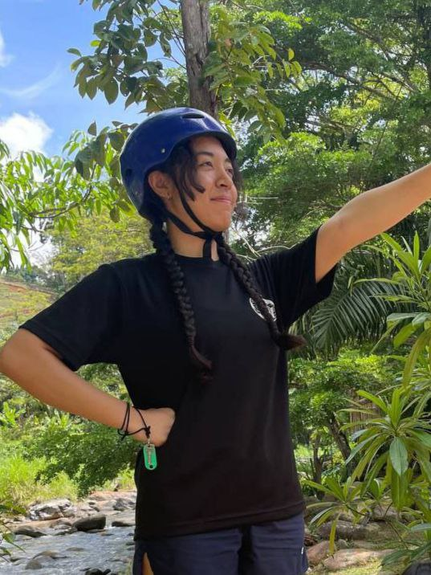

# About Us

We are a team based in the [School of Computing, National University of Singapore](http://www.comp.nus.edu.sg).

You can reach us at the email `seer[at]comp.nus.edu.sg`

## Project team

### Darren Lim

[[github](https://github.com/loyaltypollution)]
[[portfolio](team/loyaltypollution.md)]

### Alicia Chang

[[github](https://github.com/rannn367)]
[[portfolio](team/rannn367.md)]

* Role: Developer
* Responsibilities: Software Developer

### Jane Doe

[[github](http://github.com/johndoe)]
[[portfolio](team/johndoe.md)]

* Role: Team Lead
* Responsibilities: UI

### Johnny Doe

[[github](http://github.com/johndoe)] [[portfolio](team/johndoe.md)]

* Role: Developer
* Responsibilities: Data
<<<<<<< HEAD

### Jean Doe

[[github](http://github.com/johndoe)]
[[portfolio](team/johndoe.md)]

* Role: Developer
* Responsibilities: Dev Ops + Threading

### Victor Poh Hong Rong

[[github](http://github.com/whitebear82)]
[[portfolio](team/whitebear82.md)]

* Role: Developer
* Responsibilities: Software Developer
=======
>>>>>>> upstream/master
