# CaféConnect User Guide

## Welcome to CaféConnect!

Hello and welcome to **CaféConnect**! Thanks for choosing us to help manage your café. We know running a café is no easy task. We know running a café is no walk in the park; from managing customer orders, handling staff schedules, and keeping everything running smoothly, it’s easy to feel like you’re juggling too much. But with **CaféConnect**, we make it simpler, so you can spend less time stressing and more time doing what you do best—serving great food and drinks.

### Efficient Café Management
Think of **CaféConnect** like your café’s personal assistant. Whether you're adding a customer's details or checking who’s working today, everything is just a quick command away. No need to waste time scrolling through contacts or digging through papers, everything you need is right in front of you, ready to go.

### What CaféConnect Can Do for You
1. Customer Management
* **Add customer details:** Use customeradd to quickly input customer preferences, allergies, and favourite orders. You’ll remember your regulars and what they like, and they’ll appreciate the personal touch you bring every time.
* **Build customer loyalty:** The more you know about your customers, the better you can serve them. Keep track of their preferences, and they’ll keep coming back for more!
2. Staff Management
* **Effortlessly manage staff:** Use staffadd to add new staff members and store their roles and contact details. It’s all in one place, so you won’t have to worry about sifting through paper notes or trying to remember who’s working which shift.
* **Stay organised:** With all the staff details in one system, you can easily check who’s on shift and who’s available. No more confusion during the busy hours.

### Why Choose CaféConnect?

**CaféConnect** is like the swiss army knife of café management. Whether it’s adding customer info or organising staff, it’s quick, easy, and efficient. You won’t waste time clicking through complicated contact books or trying to find the right spreadsheet. Just use the command line, and you’ll get what you need in seconds. No fuss, no headache.

### Overview of Target Users

If you're a café owner who types fast and needs a simple way to manage customer details and staff, CafeConnect is for you! We know running a café can be hectic, so we designed CafeConnect to help you stay organised with just a few quick commands.

<!-- * Table of Contents -->
<page-nav-print />

--------------------------------------------------------------------------------------------------------------------

## Quick start

1. Ensure you have Java `17` or above installed in your Computer. 
   **Mac users:** Ensure you have the precise JDK version prescribed [here](https://se-education.org/guides/tutorials/javaInstallationMac.html).

1. Download the latest `.jar` file from [here](https://github.com/se-edu/addressbook-level3/releases).

1. Copy the file to the folder you want to use as the _home folder_ for your AddressBook.

1. Open a command terminal, `cd` into the folder you put the jar file in, and use the `java -jar cafeconnect.jar` command to run the application. 

   The CafeConnect home screen will appear in a few seconds, displaying the application title and navigation options.

   

     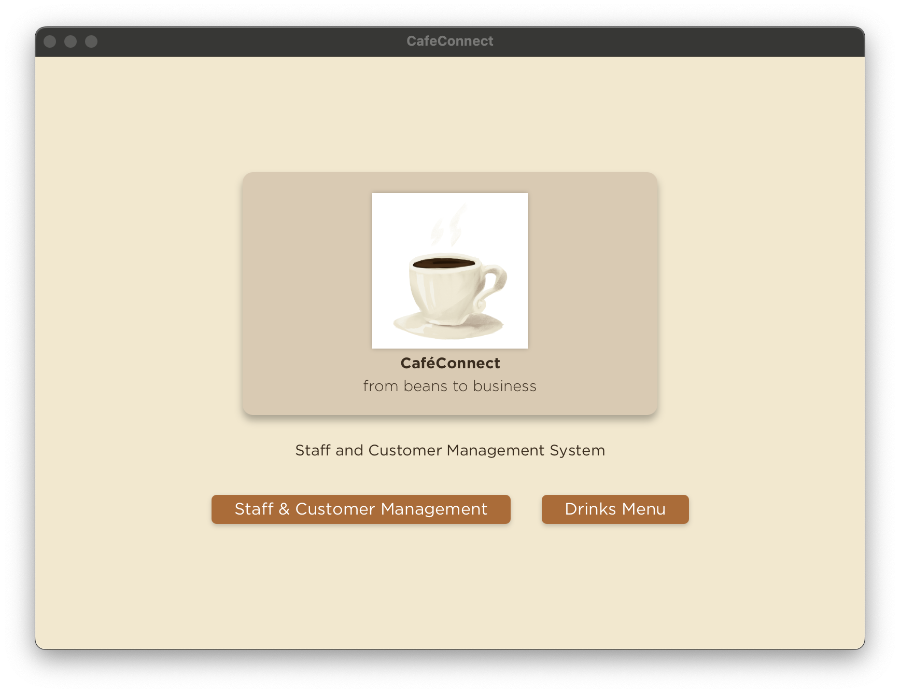
     
<i>CafeConnect Welcome Screen</i>

   

2. From the home screen, you have two navigation options:
   * Click on **Staff & Customer Management** to access staff and customer data directly
   * Click on **Drinks Menu** to view and manage the drink catalog directly

3. The Staff & Customer Management section shows the initial staff data:

   

     
     
<i>Initial Staff Screen</i>

   

   This section allows you to:
   * Add, edit, and delete staff members
   * Add, edit, and delete customers
   * Record purchases for customers
   * Track staff working hours

4. The Drinks Menu section shows the initial drink catalog:

   

     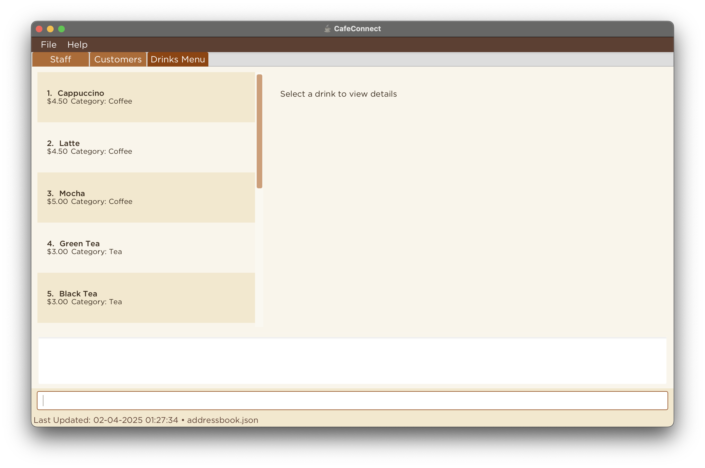
     
<i>Initial Drinks Menu</i>

   

   This section allows you to:
   * View all drinks in the catalog
   * Add new drinks to the menu
   * Categorize drinks by type

Note: The application comes with sample data to help you get started.

1. Type the command in the command box and press Enter to execute it. e.g. typing **`help`** and pressing Enter will open the help window. 
   Some example commands you can try:

   * `help` : Opens the help window with command guide.

   * `customeradd cid/C001 n/John Doe p/98765432 e/johnd@example.com a/John street, block 123, #01-01 rp/150 vc/8 fi/Cappuccino ts/120` : Adds a customer named `John Doe` to CafeConnect.

   * `staffadd sid/S1001 n/Alice Tan p/81234567 e/alice@example.com a/123, Jurong West Ave 6, #08-111 role/Barista shift/9am-5pm hours/40 rating/4.5` : Adds a staff member named `Alice Tan` to CafeConnect.

   * `purchase ind/1 n/Espresso` : Records a purchase of Espresso for the 1st customer in the list.

   * `customerdelete 3` : Deletes the 3rd customer shown in the current customer list.

   * `c C0102:Charlie:97285712` : Quickly adds a customer using the shortcut command.

   * `exit` : Exits the app.

1. Refer to the [Features](#features) below for details of each command.

--------------------------------------------------------------------------------------------------------------------

## Features

<box type="info" seamless>

**Notes about the command format in CafeConnect:** 

* Words in `UPPER_CASE` are the parameters to be supplied by the user. 
  e.g. in `customeradd cid/CUSTOMER_ID`, `CUSTOMER_ID` is a parameter which can be used as `customeradd cid/C001`.

* Items in square brackets are optional. 
  e.g. `n/NAME [t/TAG]` can be used as `n/John Doe t/regular` or as `n/John Doe`.

* Items with `…` after them can be used multiple times including zero times. 
  e.g. `[t/TAG]…` can be used as ` ` (i.e. 0 times), `t/vip`, `t/vip t/regular` etc.

* Parameters can be in any order. 
  e.g. if the command specifies `n/NAME p/PHONE`, `p/PHONE n/NAME` is also acceptable.

* Shortcut commands (`c` and `s`) require parameters in the exact order shown. 
  e.g. `c C0102:Charlie:97285712` must have Customer ID, then Name, then Phone in that order.

* Customer IDs must start with 'C' followed by digits (e.g., C1001), and Staff IDs must start with 'S' followed by digits (e.g., S1001).

* Extraneous parameters for commands that do not take parameters (such as `help`) will be ignored. 
  e.g. if the command specifies `help 123`, it will be interpreted as `help`.

* If you are using a PDF version of this document, be careful when copying and pasting commands that span multiple lines as space characters surrounding line-breaks may be omitted when copied over to the application.
</box>

### Viewing help : `help`

Shows a message explaning how to access the help page.

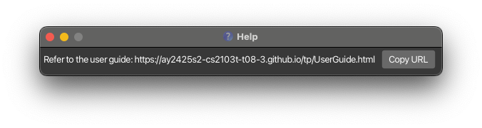

Format: `help`

## Adding a customer: `customeradd` or `c`

Adds a customer to the customer list with required details such as customer ID, name, phone, email, address, reward points, visit count, favourite item, and total spent.

Format: `customeradd cid/CUSTOMER_ID n/NAME p/PHONE e/EMAIL a/ADDRESS rp/REWARD_POINTS vc/VISIT_COUNT fi/FAVOURITE_ITEM ts/TOTAL_SPENT [t/TAG]…`

* `CUSTOMER_ID` should start with a 'C' followed by digits, e.g., C1001
* `NAME` should only contain alphanumeric characters and spaces, and it should not be blank
* `PHONE` should only contain digits, and it should be at least 3 digits long
* `EMAIL` must be a valid email address.
* `ADDRESS` can take any value, and it should not be blank
* `REWARD_POINTS` should only contain digits
* `VISIT_COUNT` should only contain digits
* `FAVOURITE_ITEM` can take any value, and it should not be blank
* `TOTAL_SPENT` should only contain digits, representing the amount in dollars

Examples:
* `customeradd cid/C001 n/John Doe p/98765432 e/johnd@example.com a/311, Clementi Ave 2, #02-25 rp/150 vc/8 fi/Cappuccino ts/120`
* `customeradd cid/C002 n/Betsy Crowe p/1234567 e/betsycrowe@example.com a/Newgate Prison rp/300 vc/15 fi/Mocha ts/250 t/vip t/regular`

These are the before and after images of the first example

  

    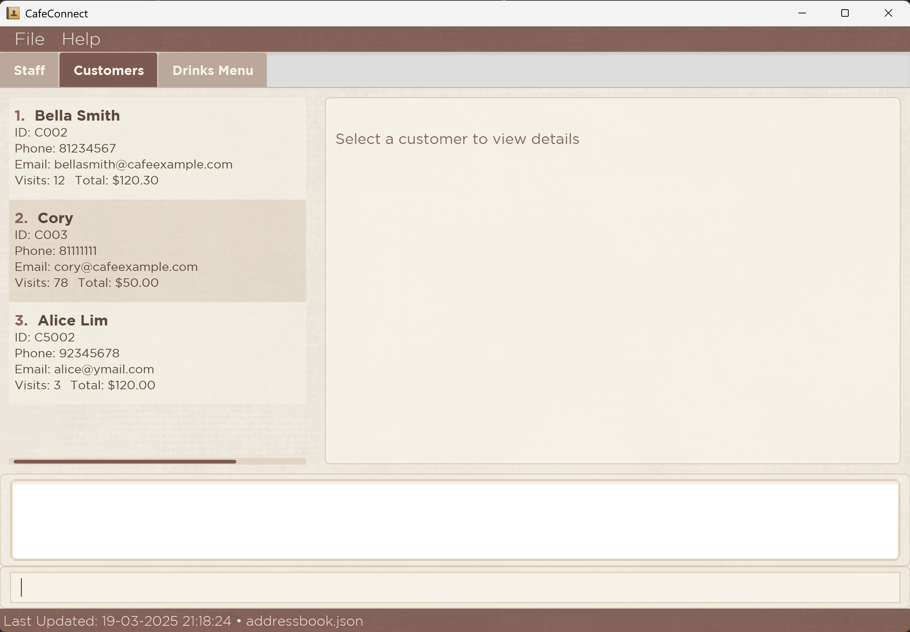
    
<i>Before adding the customer</i>

  

  

    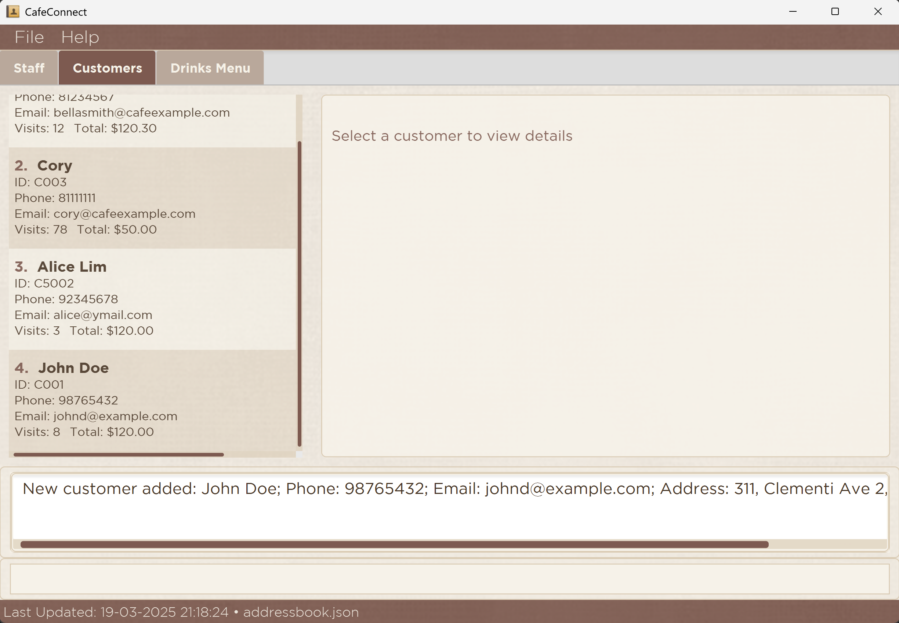
    
<i>After adding the customer</i>

  

## Adding a customer: `customeradd` or `c` (shortcut)

An extension of the customeradd command above, useful when there is a need to input customer information quickly into the system.

Format: `c <CUSTOMER_ID>:<NAME>:<PHONE>`

* `CUSTOMER_ID` should start with a 'C' followed by digits, e.g., C1001
* `NAME` should only contain alphanumeric characters and spaces, and it should not be blank
* `PHONE` should only contain digits, and it should be at least 3 digits long

Examples:
* `c C0102:Charlie:97285712`
* `c C0103:Charles:80192832`

These are the before and after images of the first example

  

    
    
<i>Before adding the customer</i>

  

  

    
    
<i>After adding the customer</i>

  

## Deleting a customer: `customerdelete`

Deletes the specified customer from CafeConnect.

Format: `customerdelete INDEX`

* Deletes the customer at the specified `INDEX`.
* The `INDEX` refers to the index number shown in the displayed customer list.
* The `INDEX` **must be a positive integer** 1, 2, 3, …
* The `INDEX` **must be a valid index number** (e.g. 5 is not valid when there is less than five applications in the displayed list).

Examples:
* `customerdelete 2` deletes the 2nd customer in the customer list.
* `customerdelete 4` when you only have three customers returns an error message.

These are the before and after images of the first example

  

    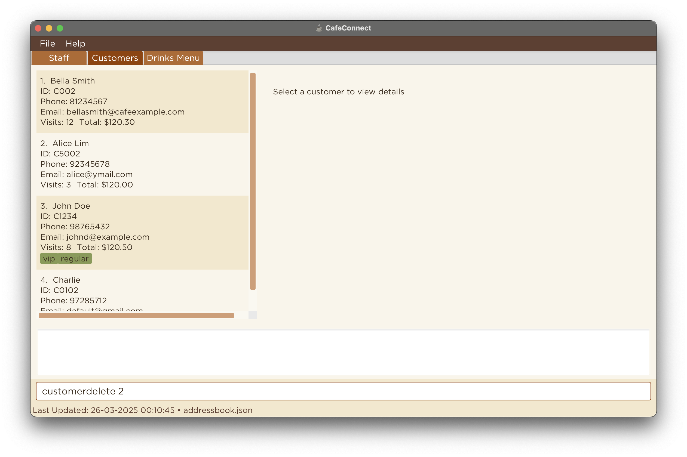
    
<i>Before deleting the customer</i>

  

  

    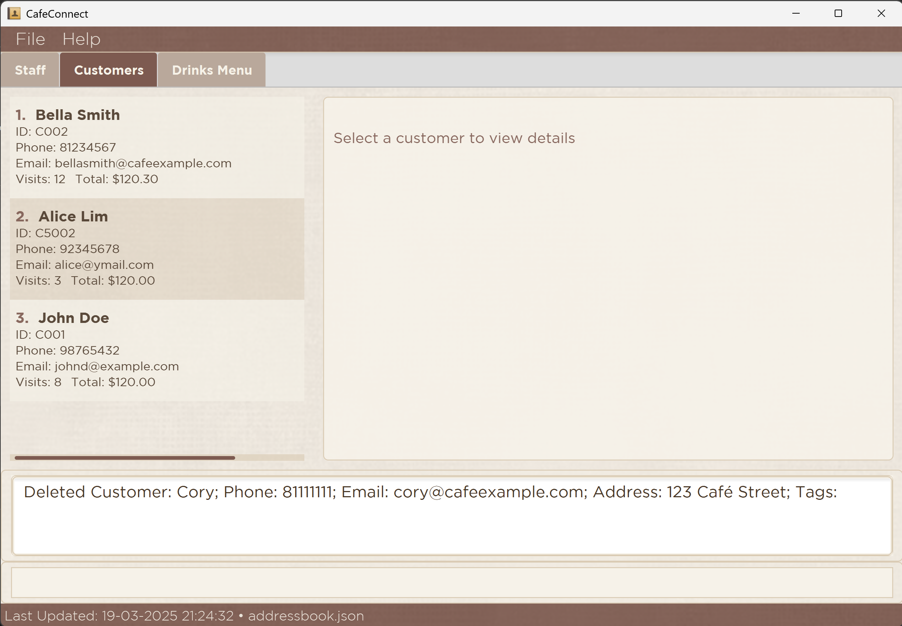
    
<i>After deleting the customer</i>

  

### Editing customer details `[coming in v1.4]`

_Details coming soon ..._

## Adding a staff: `staffadd` or `s`

Adds a staff to the staff list with required details such as staff ID, name, phone, email, address, role, shift, hours worked, and performance rating.

Format: `staffadd sid/STAFF_ID n/NAME p/PHONE e/EMAIL a/ADDRESS role/ROLE shift/SHIFT_TIMING hours/HOURS_WORKED rating/PERFORMANCE_RATING [t/TAG]...…`

* `STAFF_ID` should start with a 'S' followed by digits, e.g., S1001
* `NAME` should only contain alphanumeric characters and spaces, and it should not be blank
* `PHONE` should only contain digits, and it should be at least 3 digits long
* `EMAIL` must be a valid email address
* `ADDRESS` can take any value, and it should not be blank
* `SHIFT_TIMING` should only contain digits
* `HOURS_WORKED` should only contain digits
* `PERFORMANCE_RATING` can take any value, and it should not be blank
* `TAG` can take any value, optional field

Examples:
* `staffadd sid/S1234 n/Alice Tan p/81234567 e/alice@example.com a/123, Jurong West Ave 6, #08-111 role/Barista shift/9am-5pm hours/40 rating/4.5 t/fullTime t/experienced`
* `staffadd sid/S0101 n/Bob Lim p/82019292 e/bob@example.com a/123, Tampines West Ave 7, #09-121 role/Barista shift/5pm-11pm hours/30 rating/4.5 t/fullTime`

These are the before and after images of the first example

  

    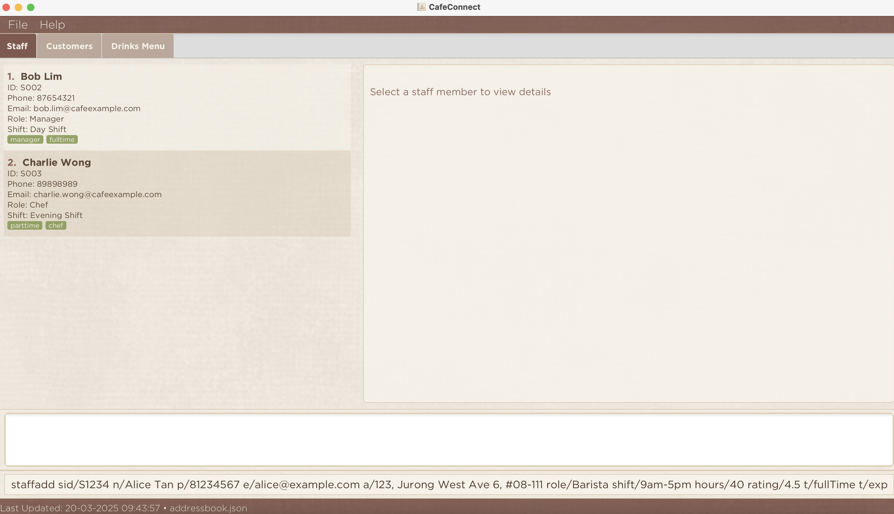
    
<i>Before adding the staff</i>

  

  

    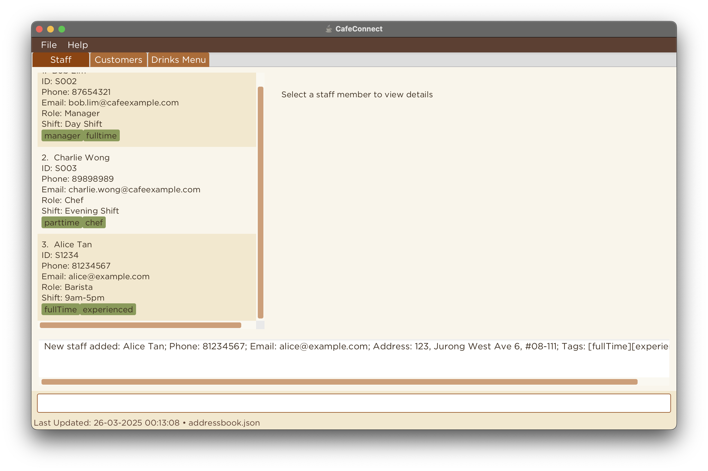
    
<i>After adding the staff</i>

  

## Adding a staff: `staffadd` or `s` (shortcut)

An extension of the staffadd command above, useful when there is a need to input staff information quickly into the system.

Format: `s <STAFF_ID>:<NAME>:<PHONE>`

* `STAFF_ID` should start with a 'S' followed by digits, e.g., S1001
* `NAME` should only contain alphanumeric characters and spaces, and it should not be blank
* `PHONE` should only contain digits, and it should be at least 3 digits long

Examples:
* `s S0102:Ali:98291029`
* `s S0103:Bali:89201029`

These are the before and after images of the first example

  

    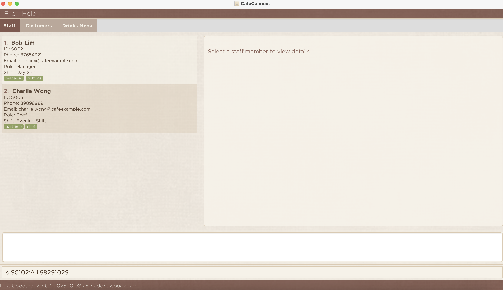
    
<i>Before adding the staff</i>

  

  

    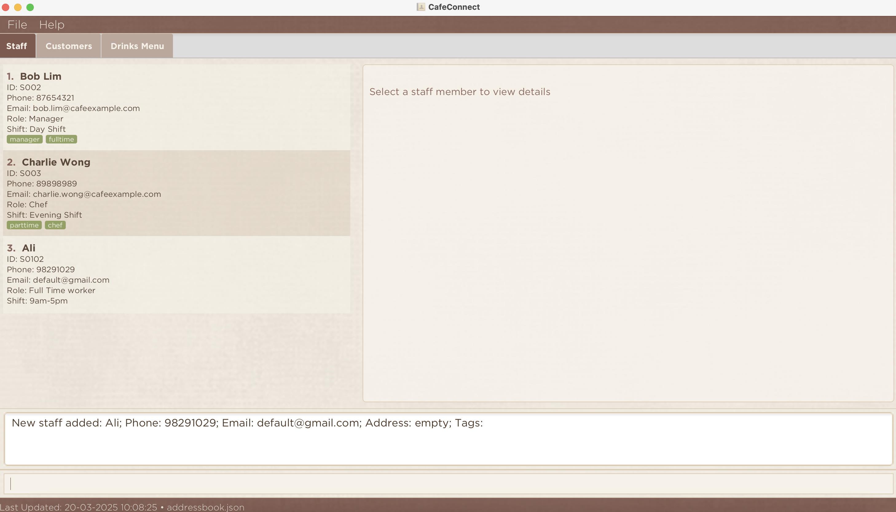
    
<i>After adding the staff</i>

  

## Deleting a staff: `staffdelete`

Deletes the specified staff from the address book.

Format: `staffdelete INDEX`

* Deletes the staff at the specified `INDEX`.
* The `INDEX` refers to the index number shown in the displayed staff list.
* The `INDEX` **must be a positive integer** 1, 2, 3, …
* The `INDEX` **must be a valid index number** (e.g. 5 is not valid when there is less than five applications in the displayed list).

Examples:
* `staffdelete 2` deletes the 2nd staff in the address book.
* `staffdelete 4` when you only have three staff returns an error message.

These are the before and after images of the first example

  

    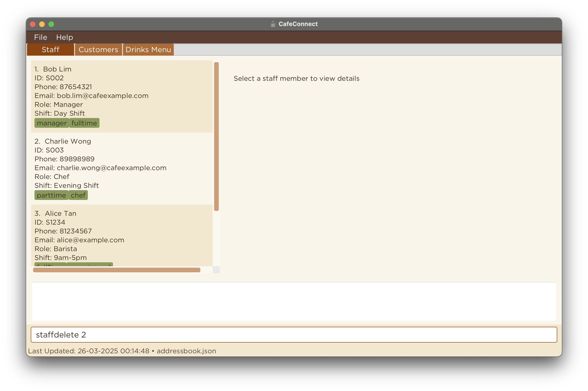
    
<i>Before deleting the staff</i>

  

  

    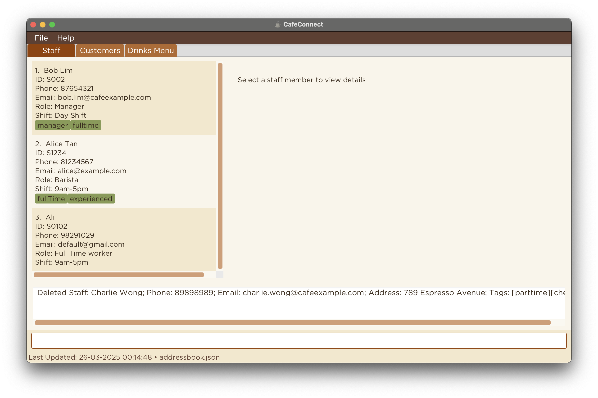
    
<i>After deleting the staff</i>

  

## Editing staff details: `staffedit`

Edits the details of an existing staff in the staff list.

Format: `staffedit INDEX [sid/STAFF_ID] [n/NAME] [p/PHONE] [e/EMAIL] [a/ADDRESS] [role/ROLE] [shift/SHIFT_TIMING] [hours/HOURS_WORKED] [rating/PERFORMANCE_RATING] [t/TAG]...`

* Edits the staff at the specified `INDEX`.
* The `INDEX` refers to the index number shown in the displayed staff list.
* The `INDEX` **must be a positive integer** 1, 2, 3, …
* The `INDEX` **must be a valid index number** (e.g., 5 is not valid when there are fewer than five staff members in the displayed list).
* At least one of the optional fields must be provided.
* Existing values will be overwritten by the input values.
* When editing tags, the existing tags of the staff will be removed i.e., adding of tags is not cumulative.
* You can remove all the staff's tags by typing `t/` without specifying any tags after it.

Examples:
* `staffedit 1 p/99994567 e/newemail@example.com` edits the phone number and email address of the 1st staff to be `99994567` and `newemail@example.com` respectively.
* `staffedit 2 n/Betsy Crower sid/S002 t/` edits the name of the 2nd staff to be `Betsy Crower`, changes the staff ID to `S002`, and clears all existing tags.

These are the before and after images of the first example

  

    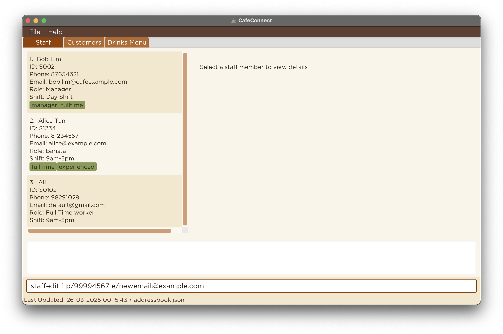
    
<i>Before editing staff details</i>

  

  

    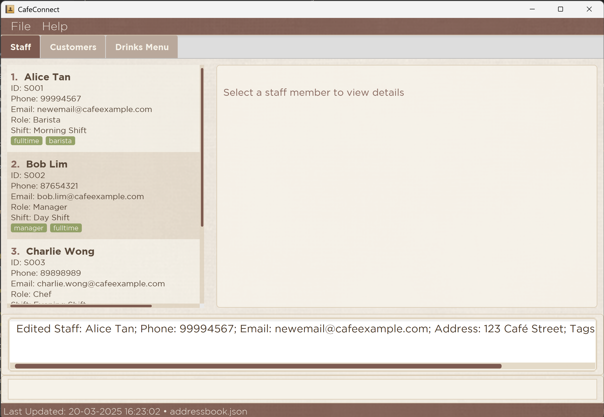
    
<i>After editing staff details</i>

  

## Adding hours worked for a staff: `hoursadd`

Adds number of hours worked for a staff.

Format: `hoursadd ind/<INDEX> h/<HOURS>`

* Records a purchase for the customer at the specified `INDEX`.
* The `INDEX` refers to the index number shown in the displayed staff list.
* The `INDEX` **must be a positive integer** 1, 2, 3, …
* The `INDEX` **must be a valid index number** (e.g., 5 is not valid when there are fewer than five customers in the displayed list).
* `HOURS` is the desired number of hours to add to the staff's total hours worked.

Examples:
* `hoursadd ind/1 h/5` adds 5 hours worked to the 1st staff in the list.
* `hoursadd ind/9 h/5` when you have less than 9 staff returns an error.

These are the before and after images of the first example

  

    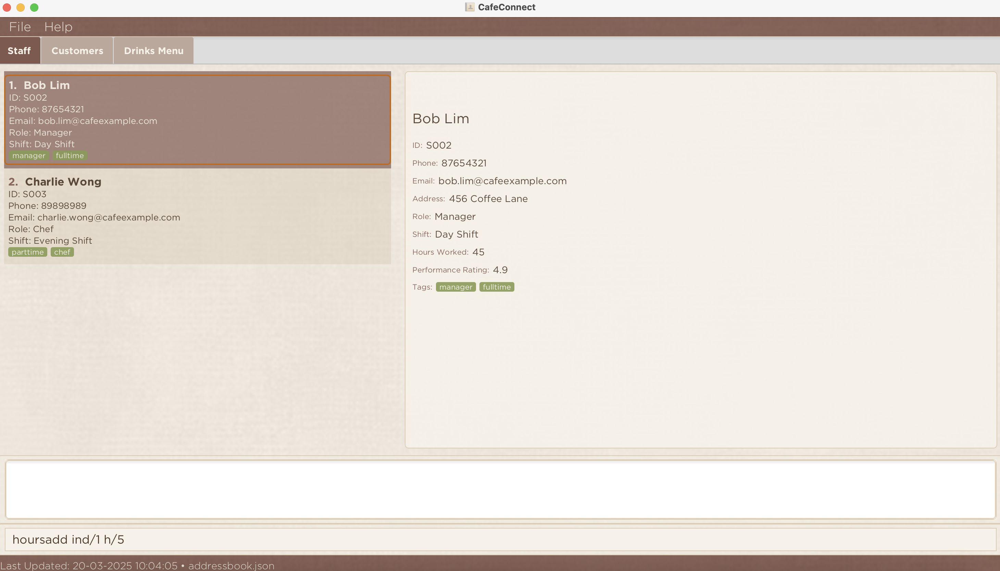
    
<i>Before adding hours worked for the staff</i>

  

  

    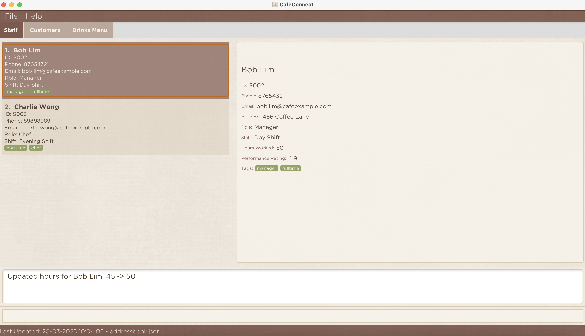
    
<i>After adding hours worked for the staff</i>

  

## Adding a drink: `drinkadd`

Adds a new drink to the drink catalog with details such as name, price, and category.

Format: `drinkadd n/NAME p/PRICE c/CATEGORY`

* `NAME` is the name of the drink
* `PRICE` should be a positive number with up to 2 decimal places
* `CATEGORY` is the classification of the drink (e.g., Coffee, Tea, etc.)

Examples:
* `drinkadd n/Iced Latte p/4.50 c/Coffee` adds an Iced Latte under the Coffee category with a price of $4.50
* `drinkadd n/Chai Tea p/3.80 c/Tea` adds a Chai Tea under the Tea category with a price of $3.80

These are the before and after images of the first example

  

    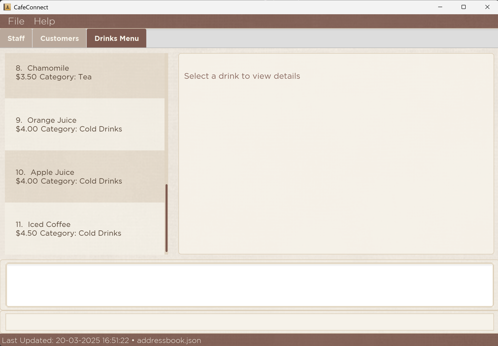
    
<i>Before adding the drink</i>

  

  

    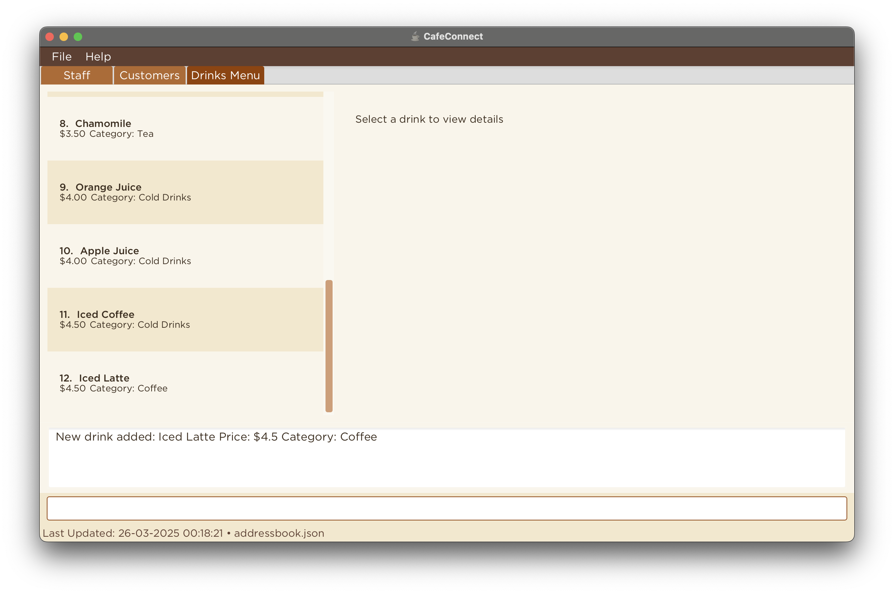
    
<i>After adding the drink</i>

  

## Recording a purchase: `purchase`

Records a purchase for a customer, updating their total spent, visit count, and reward points. Optionally, allows users to redeem reward points to pay for the purchase.

Format: `purchase INDEX n/DRINK_NAME [redeem/true]`

* Records a purchase for the customer at the specified `INDEX`.
* The `INDEX` refers to the index number shown in the displayed customer list.
* The `INDEX` **must be a positive integer** 1, 2, 3, …
* The `INDEX` **must be a valid index number** (e.g., 5 is not valid when there are fewer than five customers in the displayed list).
* `DRINK_NAME` must match a drink that exists in the drink catalog.
* For standard purchases (without redemption):
  * For every $1 spent, customers earn 10 reward points.
  * Total spent is updated with the drink price.
* For redemption purchases (with `redeem/true`):
  * Reward points are deducted at a rate of 100 points = $1 (e.g., a $4.50 drink costs 450 points).
  * Total spent is not updated as the purchase is made with points.
* Visit count will be incremented by 1 for each purchase, including redemptions.

Examples:
* `purchase 1 n/Espresso` records a regular purchase of an Espresso for the 1st customer, updating their total spent and adding reward points.
* `purchase 2 n/Cappuccino redeem/true` redeems a Cappuccino for the 3rd customer using their reward points.

### Standard Purchase

These are the before and after images of a standard purchase using the first example

  

    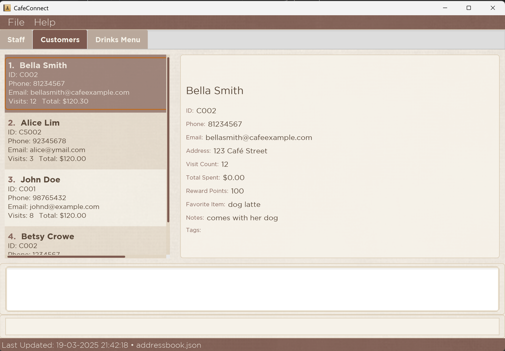
    
<i>Before standard purchase</i>

  

  

    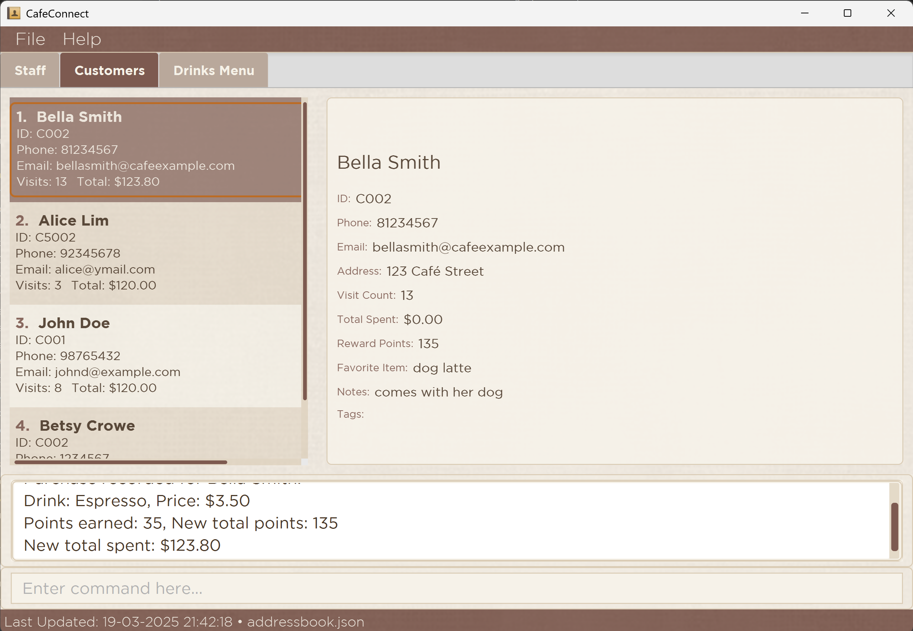
    
<i>After standard purchase (points added and total spent increased)</i>

  

### Redemption Purchase

These are the before and after images of a redemption purchase using the second example

  

    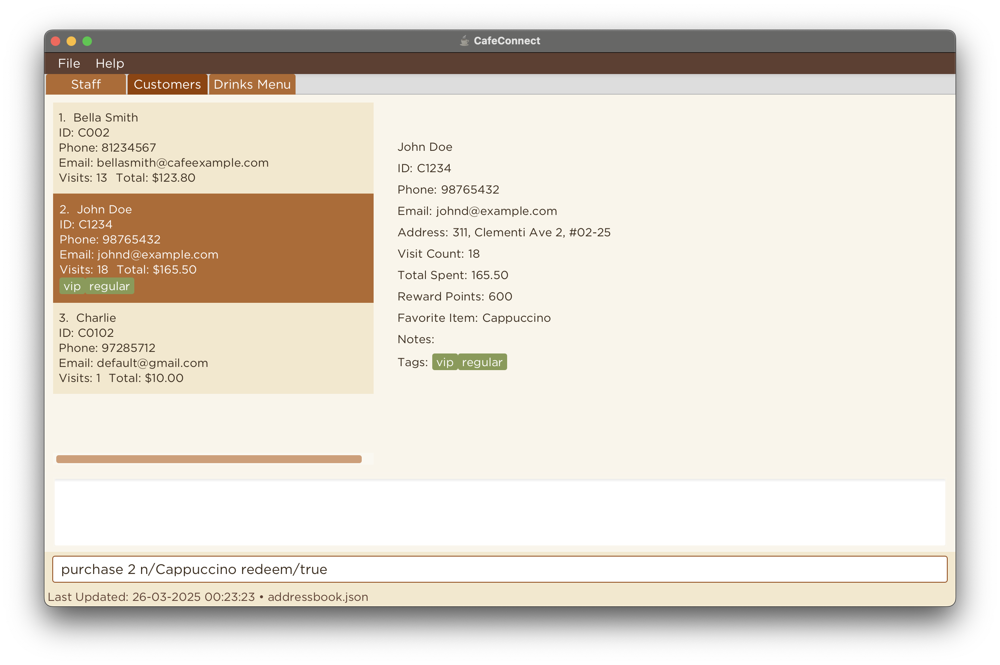
    
<i>Before redemption purchase</i>

  

  

    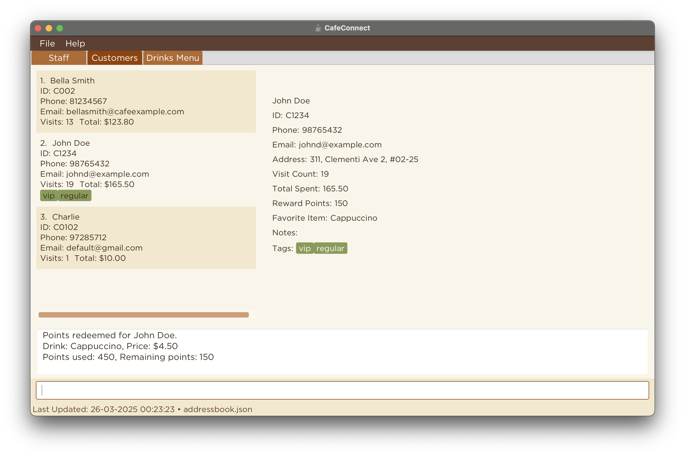
    
<i>After redemption purchase (points deducted, total spent unchanged)</i>

  

### Exiting the program : `exit`

Exits the program.

Format: `exit`

### Saving the data

CafeConnect data are saved in the hard disk automatically after any command that changes the data. There is no need to save manually.

### Editing the data file

CafeConnect data are saved automatically in the following JSON files:
- Address book data: `[JAR file location]/data/addressbook.json`
- Drink catalog data: `[JAR file location]/data/drinkcatalog.json`
- User preferences: `[JAR file location]/preferences.json`

Advanced users are welcome to update data directly by editing these data files.

<box type="warning" seamless>

**Caution:**
If your changes to any data file makes its format invalid, CafeConnect will discard all data in that file and start with an empty data file at the next run. Hence, it is recommended to take a backup of the files before editing them. 
Furthermore, certain edits can cause CafeConnect to behave in unexpected ways (e.g., if a value entered is outside the acceptable range for the address book, drink catalog, or user preferences). Therefore, edit the data files only if you are confident that you can update them correctly.
</box>

--------------------------------------------------------------------------------------------------------------------

## FAQ

Get your questions or doubts about CafeConnect's functionality and details answered here. If you have further questions, you can contact us through our email cafeconnect@gmail.com.

#### Q1: Where is the data for the application stored?

Ans: CafeConnect's data is saved automatically as JSON files `[JAR file location]/data/addressbook.json` for customer and staff data, `[JAR file location]/data/drinkcatalog.json` for drink catalog data, and `[JAR file location]/preferences.json` for user preferences. You can make a backup of these files if you wish to.

#### Q2: How do I transfer my data to another computer?

Ans: Install CafeConnect on the other computer. Then copy and replace the following files from your current installation to the new one:
- `[JAR file location]/data/addressbook.json` (for customer and staff data)
- `[JAR file location]/data/drinkcatalog.json` (for drink catalog data)
- `[JAR file location]/preferences.json` (for user preferences)

#### Q3: Can I edit the data files directly?

Ans: You are strongly encouraged to **not** edit the JSON data files directly. You can use the commands as mentioned above to manage any data. Should the changes made to the data files cause the format to be invalid, CafeConnect will discard all data and start with an empty data file. It is highly recommended to make a copy of the data files before editing them.

Users should only edit the data files only if they are confident in updating them correctly.

#### Q4: What is considered valid, when editing the JSON data files directly?

Ans: Data entries are valid, if they are achievable through a sequence of commands.

Examples:
Having `C001` is an invalid `customerId` field for a customer, if it's already assigned to another customer, as there is no sequence of commands that will lead to duplicate customer IDs.

Having `regular` is a valid `tag` field for a customer, as the user can `/customeradd` a customer and add the tag via `t/regular`.

#### Q5: How are reward points calculated?

Ans: Currently, customers earn 10 points for every $1 spent on purchases. Points are automatically updated when you record a purchase using the `purchase` command.

#### Q6: Will my customer's reward points expire?

Ans: CafeConnect doesn't have a built-in expiration for reward points. Points accumulate indefinitely until used.

#### Q7: What happens if I try to record a purchase for a drink that's not in the catalog?

Ans: The system will display an error message indicating that the drink was not found in the catalog.

#### Q8: After I add a new customer or staff, where will they appear in the list?

Ans: New entries will not be inserted in any specific order. They are inserted to the bottom of the list.

#### Q9: Will adding/deleting customers or staff be reflected immediately in the UI?

Ans: Yes, all changes to customer or staff data are immediately reflected in the UI. The information panels will update to show the current state of your data.

#### Q10: Can I use shortcuts to add customers and staff quickly?

Ans: Yes, you can use the shortcut commands:
- For customers: `c C0102:Charlie:97285712`
- For staff: `s S0102:Ali:98291029`

These shortcuts allow you to quickly add basic information, which you can later edit to add more details if needed.

#### Q11: Can I import existing customer data from CSV or Excel files?

Ans: Currently, CafeConnect doesn't support direct importing from spreadsheet files. You'll need to enter customer and staff data manually.

#### Q12: How do I track staff working hours?

Ans: Use the `hoursadd ind/INDEX h/HOURS` command to add worked hours to a staff member's record. The hours will be added to their current total.

#### Q13: Can I edit a customer's visit count directly?

Ans: No, the visit count is automatically incremented each time you record a purchase for that customer.

--------------------------------------------------------------------------------------------------------------------

## Known issues

1. **When using multiple screens**, if you move the application to a secondary screen, and later switch to using only the primary screen, the GUI will open off-screen. The remedy is to delete the `preferences.json` file created by the application before running the application again.
2. **If you minimize the Help Window** and then run the `help` command (or use the `Help` menu, or the keyboard shortcut `F1`) again, the original Help Window will remain minimized, and no new Help Window will appear. The remedy is to manually restore the minimized Help Window.

--------------------------------------------------------------------------------------------------------------------

## Command Summary

Action | Format, Examples
-------|----------------------------------------------------------------------------------------------------------------------------------------------------------------------
**Add Customer** | `customeradd cid/CUSTOMER_ID n/NAME p/PHONE e/EMAIL a/ADDRESS rp/REWARD_POINTS vc/VISIT_COUNT fi/FAVOURITE_ITEM ts/TOTAL_SPENT [t/TAG]…`   e.g., `customeradd cid/C001 n/John Doe p/98765432 e/johnd@example.com a/311, Clementi Ave 2, #02-25 rp/150 vc/8 fi/Cappuccino ts/120 t/regular`
**Add Customer (Shortcut)** | `c <CUSTOMER_ID>:<NAME>:<PHONE>`   e.g., `c C0102:Charlie:97285712`
**Delete Customer** | `customerdelete INDEX`   e.g., `customerdelete 2`
**Edit Customer** | details to be added soon...
**Add Staff** | `staffadd sid/STAFF_ID n/NAME p/PHONE e/EMAIL a/ADDRESS role/ROLE shift/SHIFT_TIMING hours/HOURS_WORKED rating/PERFORMANCE_RATING [t/TAG]...`   e.g., `staffadd sid/S1234 n/Alice Tan p/81234567 e/alice@example.com a/123, Jurong West Ave 6, #08-111 role/Barista shift/9am-5pm hours/40 rating/4.5 t/fullTime`
**Add Staff (Shortcut)** | `s <STAFF_ID>:<NAME>:<PHONE>`   e.g., `s S0102:Ali:98291029`
**Delete Staff** | `staffdelete INDEX`   e.g., `staffdelete 2`
**Edit Staff** | `staffedit INDEX [sid/STAFF_ID] [n/NAME] [p/PHONE] [e/EMAIL] [a/ADDRESS] [role/ROLE] [shift/SHIFT_TIMING] [hours/HOURS_WORKED] [rating/PERFORMANCE_RATING] [t/TAG]...`   e.g., `staffedit 1 p/99994567 e/newemail@example.com`
**Add Hours** | `hoursadd ind/INDEX h/HOURS`   e.g., `hoursadd ind/1 h/5`
**Add Drink** | `drinkadd n/NAME p/PRICE c/CATEGORY`   e.g., `drinkadd n/Iced Latte p/4.50 c/Coffee`
**Purchase** | `purchase INDEX n/DRINK_NAME [redeem/true]`   e.g., `purchase 1 n/Espresso` or `purchase 2 n/Cappuccino redeem/true`
**Help** | `help`
