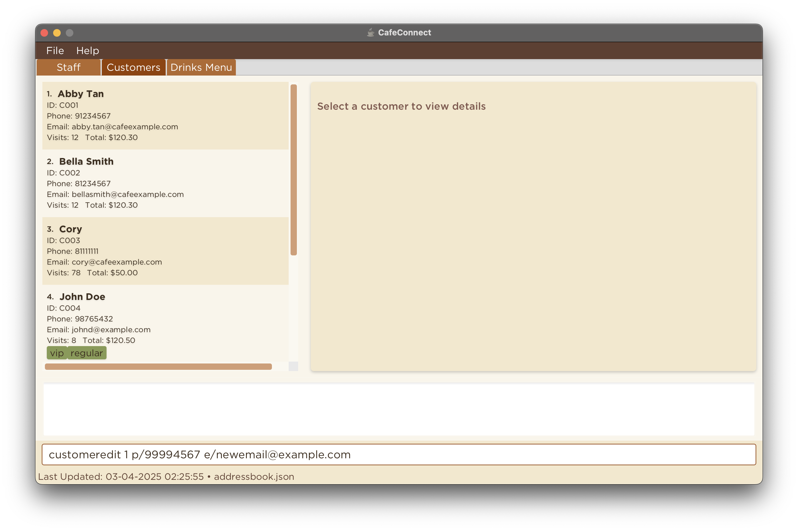
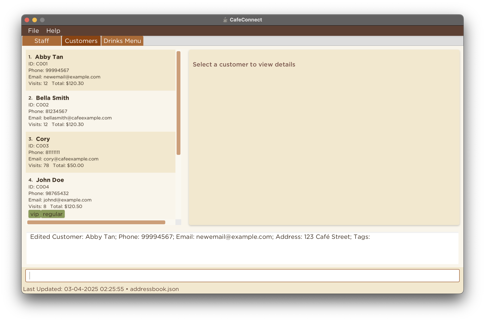
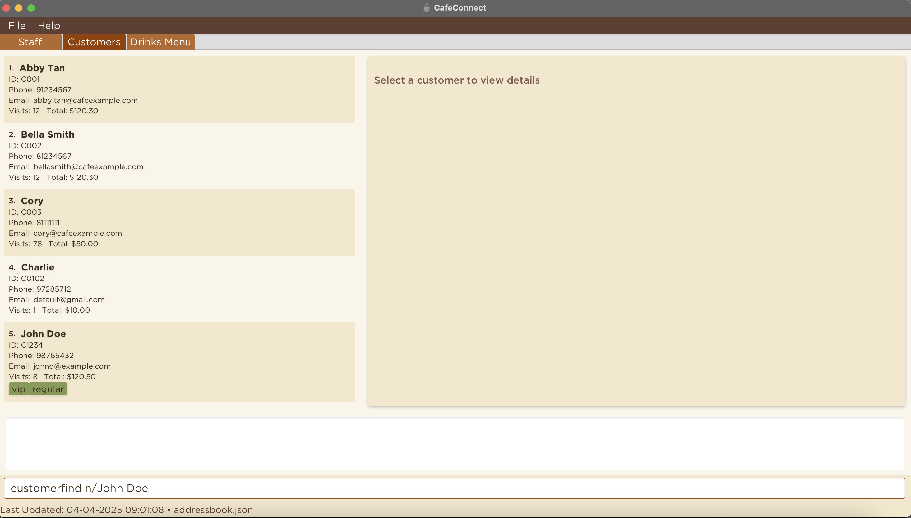
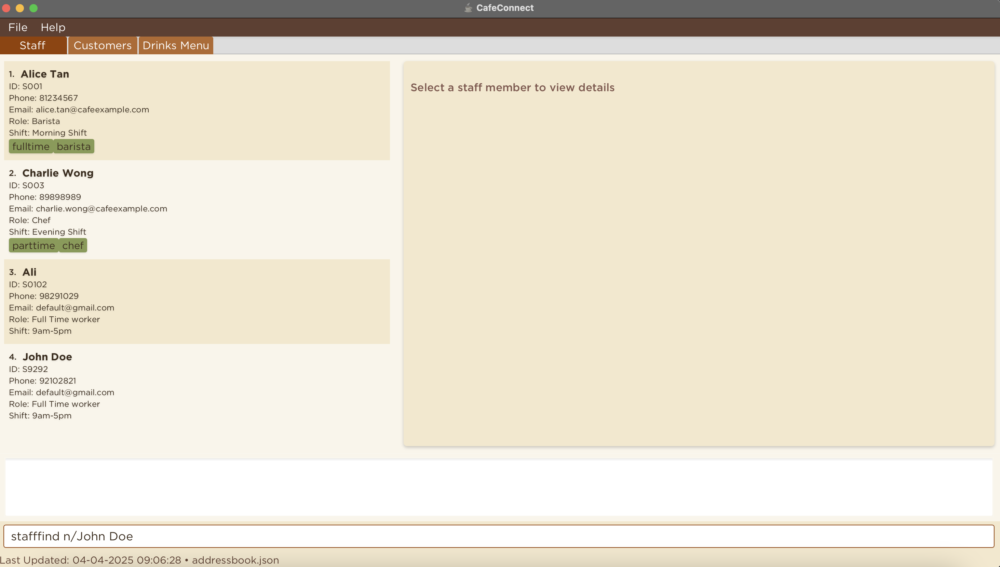
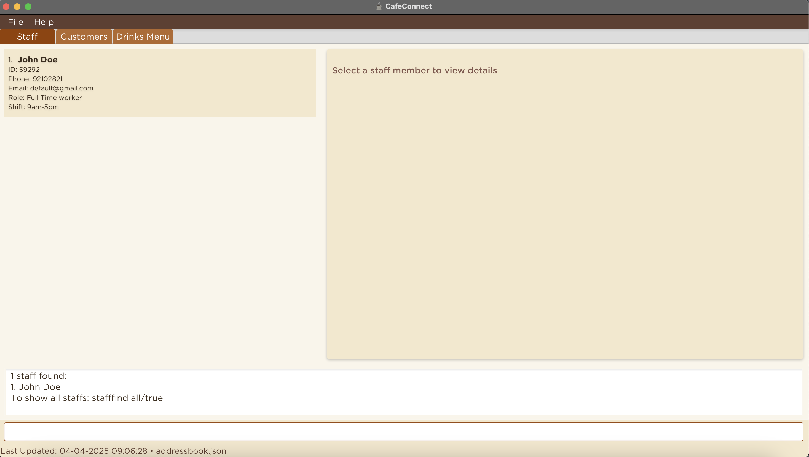
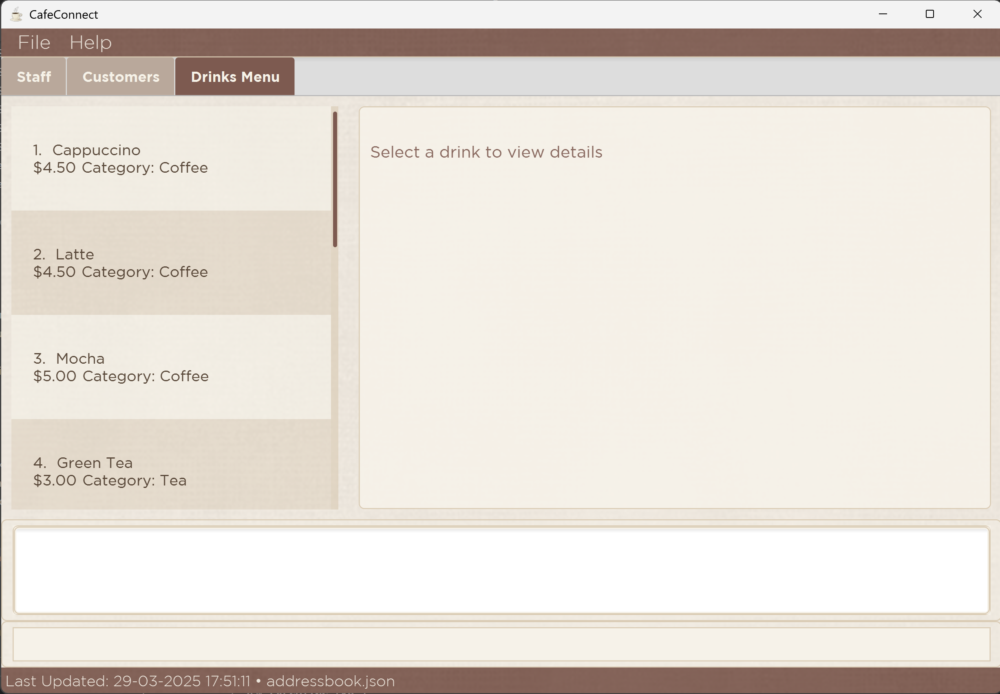
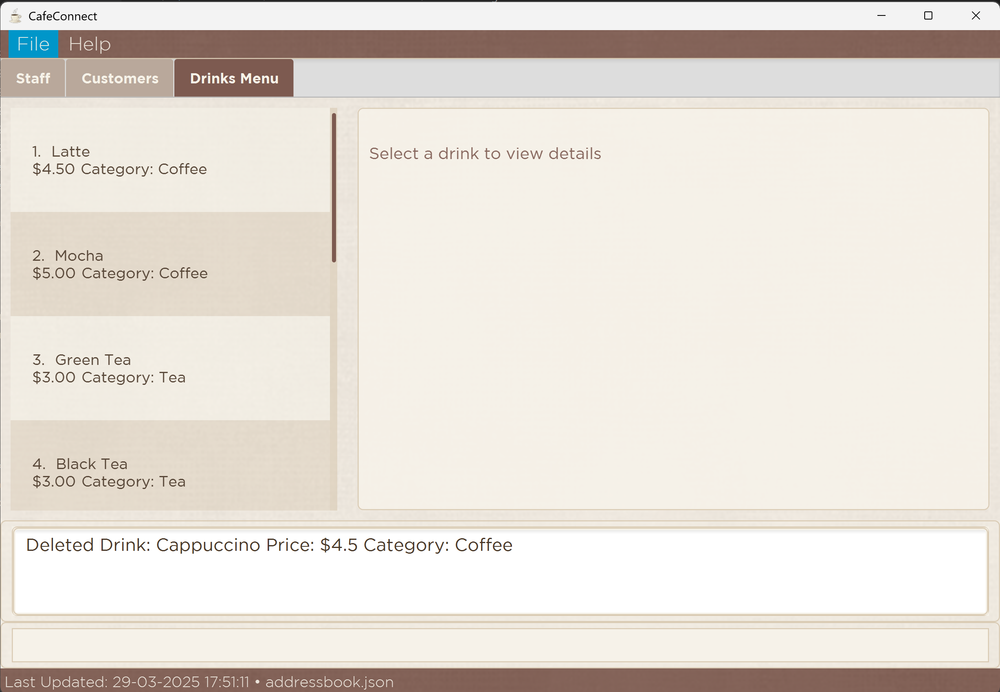
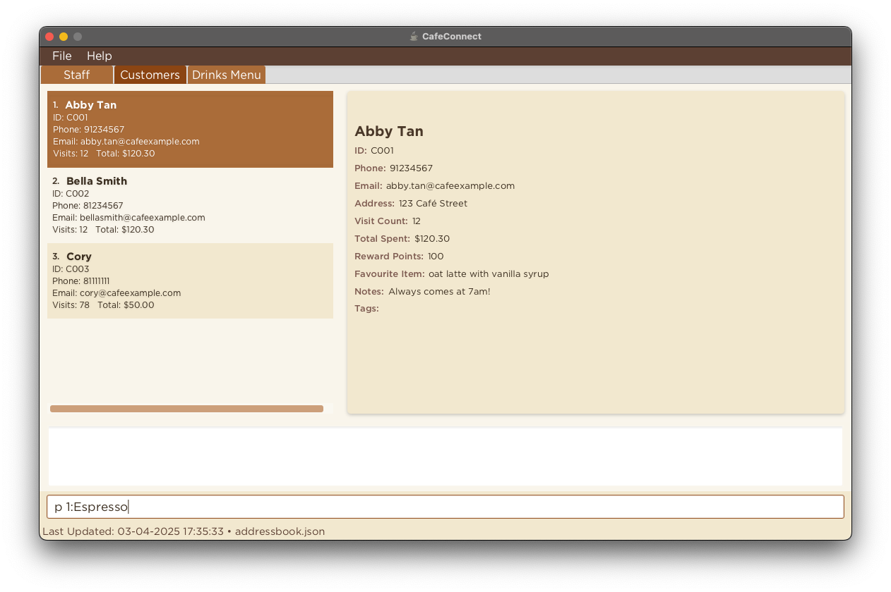

# CaféConnect User Guide

## Welcome to CaféConnect!

Thank you for choosing **CaféConnect** to streamline your café management experience. With so many details to track in a busy café environment, managing customers, staff, and inventory becomes a real challenge. **CaféConnect** is here to keep you organized and focused on what matters most—providing excellent service to your customers.

*Use CaféConnect to bring efficiency to your café management!*

## Overview of User Guide

CaféConnect is a streamlined desktop application that helps you manage customers, staff, and your drink menu all in one place.

* **Easy to use**
  * **Type simple commands:** If you can type fast, CaféConnect can get your café management tasks done faster than traditional apps.
  * **Simple design:** View all your customer and staff information at a glance.
* **Efficient management**
  * **Core features:** Add, delete, edit, and find customer and staff entries quickly.
  * **Advanced features:** Record purchases, manage reward points, and track customer visits.
* **Comprehensive tracking**
  * **Customer insights:** Track customer preferences, visit history, and favorite items.
  * **Staff organization:** Manage staff details, roles, shifts, and performance ratings.

--------------------------------------------------------------------------------------------------------------------
### Table of Contents

<!-- Table of Contents -->

  * [Welcome to CaféConnect!](#welcome-to-cafeconnect)
  * [Overview of User Guide](#overview-of-user-guide)
  * [Overview of target users](#overview-of-target-users)
  * [How to use our User Guide](#how-to-use-our-user-guide)
  * [Quick start](#quick-start)
  * [Features](#features)
    * [Adding a customer: `customeradd` or `c`](#adding-a-customer-customeradd-or-c)
    * [Adding a customer (shortcut): `c` shortcut](#adding-a-customer-customeradd-or-c-shortcut)
    * [Deleting a customer: `customerdelete` or `cd`](#deleting-a-customer-customerdelete-or-cd)
    * [Editing customer details: `customeredit` or `ce`](#editing-customer-details-customeredit-or-ce)
    * [Finding a customer: `customerfind` or `cf`](#finding-a-customer-customerfind-or-cf)
    * [Adding a staff: `staffadd` or `s`](#adding-a-staff-staffadd-or-s)
    * [Adding a staff (shortcut): `s` shortcut](#adding-a-staff-staffadd-or-s-shortcut)
    * [Deleting a staff: `staffdelete` or `sd`](#deleting-a-staff-staffdelete-or-sd)
    * [Editing staff details: `staffedit` or `se`](#editing-staff-details-staffedit-or-se)
    * [Finding a staff: `stafffind` or `sf`](#finding-a-staff-stafffind-or-sf)
    * [Adding a drink: `drinkadd` or `da`](#adding-a-drink-drinkadd-or-da)
    * [Deleting a drink: `drinkdelete` or `dd`](#deleting-a-drink-drinkdelete-or-dd)
    * [Recording a purchase: `purchase`](#recording-a-purchase-purchase)
    * [Recording a purchase (shortcut): `p` shortcut](#recording-a-purchase-purchase-or-p-shortcut)
  * [FAQ](#faq)
  * [Known Issues](#known-issues)
  * [Command Summary](#command-summary)
  * [Glossary](#glossary)
  * [Acknowledgements](#acknowledgements)

<!-- TOC -->
--------------------------------------------------------------------------------------------------------------------
## Overview of target users

If you're a café owner or manager who **values efficiency**, can **type quickly**, and wants to **better manage your café operations**, CaféConnect is the perfect solution for you! Managing café information can be time-consuming and error-prone with traditional methods. We understand the importance of organization, which is why we created CaféConnect to help you **stay organized with minimal effort**, knowing that you're busy with the day-to-day operations of your café.

--------------------------------------------------------------------------------------------------------------------
## How to use our User Guide

First time using **CaféConnect**? Don't worry! We've got you covered! This guide will help maximize your usage of **CaféConnect**.

* To get started, refer to the **Command Format** section below, which will walk you through the basics of entering commands.
* Need a quick reference of the commands available? Check out the **Command Summary** at the end of this guide.
* Have a specific question? Browse through the relevant sections for detailed information.

Before continuing, here are some important things you need to know about the User Guide:

1. There are two different kinds of boxes that provide extra information.
    * *Note boxes* provide important information that you should take note of.

      <box type="info" seamless>
      
      **Note:** This is a Note box.
      </box>

    * *Warning boxes* provide a warning about certain errors that might occur as a precaution for incorrect usage.

      <box type="warning" seamless>

      **Warning:** This is a warning box.
      </box>

2. The application has three main tabs:
   * **Staff** - For managing staff information
   * **Customers** - For managing customer information
   * **Drinks Menu** - For managing your drink offerings

--------------------------------------------------------------------------------------------------------------------
## Quick start

1. Ensure you have Java `17` or above installed on your computer. 
   **Mac users:** Ensure you have the precise JDK version prescribed [here](https://se-education.org/guides/tutorials/javaInstallationMac.html).

1. Download the latest `.jar` file from [here](https://github.com/se-edu/addressbook-level3/releases).

1. Copy the file to the folder you want to use as the _home folder_ for your **CaféConnect** application.

1. Open a command terminal, `cd` into the folder you put the jar file in, and use the `java -jar cafeconnect.jar` command to run the application. 

   The **CaféConnect** home screen will appear in a few seconds, displaying the application title and navigation options.

   

     
     
<i>CaféConnect Welcome Screen</i>

   

2. From the home screen, you have two navigation options:
   * Click on **Staff & Customer Management** to access staff and customer data directly.
   * Click on **Drinks Menu** to view and manage the drink catalog directly.

3. The Staff & Customer Management section shows the initial staff data:

   

     
     
<i>Initial Staff Screen</i>

   

   This section allows you to:
   * Add, edit, and delete staff members.
   * Add, edit, and delete customers.
   * Record purchases for customers.

4. The Drinks Menu section shows the initial drink catalog:

   

     
     
<i>Initial Drinks Menu</i>

   

   This section allows you to:
   * View all drinks in the catalog.
   * Add new drinks to the menu.
   * Categorize drinks by type.

Note: The application comes with sample data to help you get started.

1. Type the command in the command box and press Enter to execute it. e.g., typing **`help`** and pressing Enter will open the help window. 
   Some example commands you can try:

   * `help` : Opens the help window with the command guide.

   * `customeradd cid/C001 n/John Doe p/98765432 e/johnd@example.com a/John street, block 123, #01-01 rp/150 vc/8 fi/Cappuccino ts/120` : Adds a customer named `John Doe` to **CaféConnect**.

   * `staffadd sid/S1001 n/Alice Tan p/81234567 e/alice@example.com a/123, Jurong West Ave 6, #08-111 role/Barista shift/9am-5pm hours/40 rating/4.5` : Adds a staff member named `Alice Tan` to **CaféConnect**.

   * `purchase 1 n/Espresso` : Records a purchase of Espresso for the 1st customer in the list.

   * `customerdelete 3` : Deletes the 3rd customer shown in the current customer list.

   * `c C0102:Charlie:97285712` : Quickly adds a customer using the shortcut command.

   * `exit` : Exits the app.

1. Refer to the [Features](#features) below for details of each command.

--------------------------------------------------------------------------------------------------------------------

## Features

<box type="info" seamless>

**Notes about the command format in CaféConnect:** 

* Commands in CaféConnect are **case-insensitive**.  
  e.g. `customeradd`, `CUSTOMERADD`, and `CustomerAdd` all execute the same command.

* Words in `UPPER_CASE` are the parameters to be supplied by the user. 
  e.g. in `customeradd cid/CUSTOMER_ID`, `CUSTOMER_ID` is a parameter which can be used as `customeradd cid/C001`.

* Items in square brackets are optional. 
  e.g. `n/NAME [t/TAG]` can be used as `n/John Doe t/regular` or as `n/John Doe`.

* Items with `…` after them can be used multiple times including zero times. 
  e.g. `[t/TAG]…` can be used as ` ` (i.e. 0 times), `t/vip`, `t/vip t/regular` etc.

* Parameters can be in any order. 
  e.g. if the command specifies `n/NAME p/PHONE`, `p/PHONE n/NAME` is also acceptable.

* Shortcut commands (`c`, `s` and `p`) require parameters in the exact order shown. 
  e.g. `c C0102:Charlie:97285712` must have Customer ID, then Name, then Phone in that order.

* Customer IDs must start with 'C' followed by digits (e.g., C1001), and Staff IDs must start with 'S' followed by digits (e.g., S1001).

* When using staff-specific commands (like `staffadd`, `staffdelete`, etc.), the interface will automatically switch to the Staff tab.

* Similarly, when using customer-specific commands (like `customeradd`, `customerdelete`, etc.), the interface will automatically switch to the Customers tab.

* All commands have shorter command aliases that can be used instead of the full command word:
  * `c` for `customeradd`
  * `cd` for `customerdelete`
  * `ce` for `customeredit`
  * `cf` for `customerfind`
  * `s` for `staffadd`
  * `sd` for `staffdelete`
  * `se` for `staffedit`
  * `sf` for `stafffind`
  * `da` for `drinkadd`
  * `dd` for `drinkdelete`
  * `p` for `purchase`

* Some commands also have special shortcut formats (noted in their respective sections).

* Extraneous parameters for commands that do not take parameters (such as `help`) will be ignored. 
  e.g. if the command specifies `help 123`, it will be interpreted as `help`.

* If you are using a PDF version of this document, be careful when copying and pasting commands that span multiple lines as space characters surrounding line-breaks may be omitted when copied over to the application.

</box>

### Viewing help : `help`

Shows a message explaining how to access the help page.

Format: `help`

### Adding a customer: `customeradd` or `c`

Adds a customer to the customer list with required details such as customer ID, name, phone, email, address, reward points, visit count, favourite item, and total spent.

Format: `customeradd cid/CUSTOMER_ID n/NAME p/PHONE e/EMAIL a/ADDRESS rp/REWARD_POINTS vc/VISIT_COUNT fi/FAVOURITE_ITEM ts/TOTAL_SPENT [t/TAG]…`

* `CUSTOMER_ID` should start with a 'C' (case insensitive) followed by digits, e.g., C1001, c1001, and must not be longer than 10 characters
* `NAME` should only contain alphanumeric characters and spaces, and it should not be blank and must not be longer than 50 characters
* `PHONE` should only contain digits, and it should be between 3 and 20 digits long
* `EMAIL` must be a valid email address.
* `ADDRESS` can take any value, and it should not be blank and must not be longer than 100 characters
* `REWARD_POINTS` should only contain digits
* `VISIT_COUNT` should only contain digits
* `FAVOURITE_ITEM` can take any value, and it should not be blank and must not be longer than 30 characters
* `TOTAL_SPENT` should only contain digits, representing the amount in dollars

Examples:
* `customeradd cid/C001 n/John Doe p/98765432 e/johnd@example.com a/311, Clementi Ave 2, #02-25 rp/150 vc/8 fi/Cappuccino ts/120`
* `customeradd cid/C002 n/Betsy Crowe p/1234567 e/betsycrowe@example.com a/Newgate Prison rp/300 vc/15 fi/Mocha ts/250 t/vip t/regular`

These are the before and after images of the first example

  

    
    
<i>Before adding the customer</i>

  

  

    
    
<i>After adding the customer</i>

  

<box type="info" seamless>
Note: If you add more than one each of the compulsory prefixes, the command will be treated as invalid
</box>

#### Adding a customer: `customeradd` or `c` (shortcut)

An extension of the customeradd command above, useful when there is a need to input customer information quickly into the system.

Format: `c <CUSTOMER_ID>:<NAME>:<PHONE>`

* `CUSTOMER_ID` should start with a 'C' followed by digits, e.g., C1001, and must not be longer than 10 characters
* `NAME` should only contain alphanumeric characters and spaces, and it should not be blank and must not be longer than 50 characters
* `PHONE` should only contain digits, and it should be between 3 and 20 digits long

Examples:
* `c C0102:Charlie:97285712`
* `c C0103:Charles:80192832`

These are the before and after images of the first example

  

    
    
<i>Before adding the customer</i>

  

  

    
    
<i>After adding the customer</i>

  

### Deleting a customer: `customerdelete` or `cd`

Deletes the specified customer from CaféConnect.

Format: `customerdelete INDEX`

* Deletes the customer at the specified `INDEX`.
* The `INDEX` refers to the index number shown in the displayed customer list.
* The `INDEX` **must be a positive integer** 1, 2, 3, …
* The `INDEX` **must be a valid index number** (e.g. 5 is not valid when there is less than five customers in the displayed list).

Examples:
* `customerdelete 2` deletes the 2nd customer in the customer list.
* `customerdelete 4` when you only have three customers returns an error message.

These are the before and after images of the first example

  

    
    
<i>Before deleting the customer</i>

  

  

    
    
<i>After deleting the customer</i>

  

### Editing customer details: `customeredit` or `ce`

Edits the details of an existing customer in the customer list.

Format: `customeredit INDEX [cid/CUSTOMER_ID] [n/NAME] [p/PHONE] [e/EMAIL] [a/ADDRESS] [rp/REWARD_POINTS] [vc/VISIT_COUNT] [fi/FAVOURITE_ITEM] [ts/TOTAL_SPENT] [t/TAG]...`

* Edits the customer at the specified `INDEX`.
* The `INDEX` refers to the index number shown in the displayed customer list.
* The `INDEX` **must be a positive integer** 1, 2, 3, …
* The `INDEX` **must be a valid index number** (e.g., 5 is not valid when there are fewer than five customers in the displayed list).
* At least one of the optional fields must be provided.
* Existing values will be overwritten by the input values.
* When editing tags, the existing tags of the customer will be removed i.e., adding of tags is not cumulative.
* You can remove all the customer's tags by typing `t/` without specifying any tags after it.
* Character length restrictions apply as in customeradd command: NAME (max 50 chars), CUSTOMER_ID (max 10 chars), ADDRESS (max 100 chars), PHONE (3-20 chars), FAVOURITE_ITEM (max 30 chars)

Examples:
* `customeredit 1 p/99994567 e/newemail@example.com` edits the phone number and email address of the 1st customer to be `99994567` and `newemail@example.com` respectively.
* `customeredit 2 n/Betsy Crower rp/5000 t/` edits the name of the 2nd staff to be `Betsy Crower`, changes the staff ID to `S002`, and clears all existing tags.

These are the before and after images of the first example

  

    
    
<i>Before editing customer details</i>

  

  

    
    
<i>After editing customer details</i>

  

<box type="info" seamless>
Note: If you add more than one each of the compulsory prefixes, the command will be treated as invalid
</box>

### Finding a customer: `customerfind` or `cf`

Finds and lists all customers in the customer list whose names contain any of the specified keywords. The search is case-insensitive, meaning it will match names regardless of letter casing.

Format: `customerfind KEYWORD [MORE_KEYWORDS]...`
Format: `customerfind all/true` (to list all customers)

* The search will return all customers whose names contain at least one of the given keywords.
* The keywords do not need to match the full name exactly; partial matches within the name are included.
* The search is case-insensitive. For example, searching for `alice` will match `Alice`, `ALICE`, or `aLiCe`.
* Use `customerfind all/true` or `cf all/true` to display the complete list of all customers in CaféConnect.

Examples:
* `customerfind Alice` or `cf Alice` finds and lists all customers whose names contain `Alice`.
* `customerfind John Doe` or `cf John Doe` finds and lists all customers whose names contain either `John` or `Doe`.
* `customerfind all/true` or `cf all/true` lists all customers in CaféConnect.

These are the before and after images of the second example

  

    
    
<i>Before searching for a customer</i>

  

  

    
    
<i>After searching for a customer</i>

  

### Adding a staff: `staffadd` or `s`

Adds a staff to the staff list with required details such as staff ID, name, phone, email, address, role, shift, hours worked, and performance rating.

Format: `staffadd sid/STAFF_ID n/NAME p/PHONE e/EMAIL a/ADDRESS role/ROLE shift/SHIFT_TIMING hours/HOURS_WORKED rating/PERFORMANCE_RATING [t/TAG]...…`

* `STAFF_ID` should start with a 'S' (case insensitive) followed by digits, e.g., S1001, s1001, and must not be longer than 10 characters
* `NAME` should only contain alphanumeric characters and spaces, and it should not be blank and must not be longer than 50 characters
* `PHONE` should only contain digits, and it should be between 3 and 20 digits long
* `EMAIL` must be a valid email address
* `ADDRESS` can take any value, and it should not be blank and must not be longer than 100 characters
* `ROLE` can take any value, and it should not be blank and must not be longer than 50 characters
* `SHIFT_TIMING` can take any value, and it should not be blank and must not be longer than 50 characters
* `HOURS_WORKED` should only contain digits
* `PERFORMANCE_RATING` should only contain digits, and it should be between 0 to 5.0 (inclusive)
* `TAG` can take any value, optional field

Examples:
* `staffadd sid/S1234 n/Alice Tan p/81234567 e/alice@example.com a/123, Jurong West Ave 6, #08-111 role/Barista shift/9am-5pm hours/40 rating/4.5 t/fullTime t/experienced`
* `staffadd sid/S0101 n/Bob Lim p/82019292 e/bob@example.com a/123, Tampines West Ave 7, #09-121 role/Barista shift/5pm-11pm hours/30 rating/4.5 t/fullTime`

These are the before and after images of the first example

  

    
    
<i>Before adding the staff</i>

  

  

    
    
<i>After adding the staff</i>

  

<box type="info" seamless>
Note: If you add more than one each of the compulsory prefixes, the command will be treated as invalid
</box>

#### Adding a staff: `staffadd` or `s` (shortcut)

An extension of the staffadd command above, useful when there is a need to input staff information quickly into the system.

Format: `s <STAFF_ID>:<NAME>:<PHONE>`

* `STAFF_ID` should start with a 'S' followed by digits, e.g., S1001, and must not be longer than 10 characters
* `NAME` should only contain alphanumeric characters and spaces, and it should not be blank and must not be longer than 50 characters
* `PHONE` should only contain digits, and it should be between 3 and 20 digits long

Examples:
* `s S0102:Ali:98291029`
* `s S0103:Bali:89201029`

These are the before and after images of the first example

  

    
    
<i>Before adding the staff</i>

  

  

    
    
<i>After adding the staff</i>

  

### Deleting a staff: `staffdelete` or `sd`

Deletes the specified staff from the address book.

Format: `staffdelete INDEX`

* Deletes the staff at the specified `INDEX`.
* The `INDEX` refers to the index number shown in the displayed staff list.
* The `INDEX` **must be a positive integer** 1, 2, 3, …
* The `INDEX` **must be a valid index number** (e.g. 5 is not valid when there is less than five staff in the displayed list).

Examples:
* `staffdelete 2` deletes the 2nd staff in the address book.
* `staffdelete 4` when you only have three staff returns an error message.

These are the before and after images of the first example

  

    
    
<i>Before deleting the staff</i>

  

  

    
    
<i>After deleting the staff</i>

  

### Editing staff details: `staffedit` or `se`

Edits the details of an existing staff in the staff list.

Format: `staffedit INDEX [sid/STAFF_ID] [n/NAME] [p/PHONE] [e/EMAIL] [a/ADDRESS] [role/ROLE] [shift/SHIFT_TIMING] [hours/HOURS_WORKED] [rating/PERFORMANCE_RATING] [t/TAG]...`

* Edits the staff at the specified `INDEX`.
* The `INDEX` refers to the index number shown in the displayed staff list.
* The `INDEX` **must be a positive integer** 1, 2, 3, …
* The `INDEX` **must be a valid index number** (e.g., 5 is not valid when there are fewer than five staff members in the displayed list).
* At least one of the optional fields must be provided.
* Existing values will be overwritten by the input values.
* When editing tags, the existing tags of the staff will be removed i.e., adding of tags is not cumulative.
* You can remove all the staff's tags by typing `t/` without specifying any tags after it.
* Character length restrictions apply as in staffadd command: NAME (max 50 chars), STAFF_ID (max 10 chars), ADDRESS (max 100 chars), PHONE (3-20 chars), ROLE (max 50 chars), SHIFT_TIMING (max 50 chars)

Examples:
* `staffedit 1 p/99994567 e/newemail@example.com` edits the phone number and email address of the 1st staff to be `99994567` and `newemail@example.com` respectively.
* `staffedit 2 n/Betsy Crower sid/S002 t/` edits the name of the 2nd staff to be `Betsy Crower`, changes the staff ID to `S002`, and clears all existing tags.

These are the before and after images of the first example

  

    
    
<i>Before editing staff details</i>

  

  

    
    
<i>After editing staff details</i>

  

<box type="info" seamless>
Note: If you add more than one each of the compulsory prefixes, the command will be treated as invalid
</box>

### Finding a staff: `stafffind` or `sf`

Finds and lists all staffs in the staff list whose names contain any of the specified keywords. The search is case-insensitive, meaning it will match names regardless of letter casing.

Format: `stafffind KEYWORD [MORE_KEYWORDS]...`
Format: `stafffind all/true` (to list all staff)

* The search will return all staffs whose names contain at least one of the given keywords.
* The keywords do not need to match the full name exactly; partial matches within the name are included.
* The search is case-insensitive. For example, searching for `alice` will match `Alice`, `ALICE`, or `aLiCe`.
* Use `stafffind all/true` or `sf all/true` to display the complete list of all staff in CaféConnect.

Examples:
* `stafffind Alice` or `sf Alice` finds and lists all staffs whose names contain `Alice`.
* `stafffind John Doe` or `sf John Doe` finds and lists all staffs whose names contain either `John` or `Doe`.
* `stafffind all/true` or `sf all/true` lists all staff in CaféConnect.

These are the before and after images of the second example

  

    
    
<i>Before searching for a staff</i>

  

  

    
    
<i>After searching for a staff</i>

  

### Adding a drink: `drinkadd` or `da`

Adds a new drink to the drink catalog with details such as name, price, and category.

Format: `drinkadd n/NAME p/PRICE c/CATEGORY`

* `NAME` is the name of the drink
* `PRICE` should be a positive number with up to 2 decimal places
* `CATEGORY` is the classification of the drink (e.g., Coffee, Tea, etc.)

Examples:
* `drinkadd n/Iced Latte p/4.50 c/Coffee` adds an Iced Latte under the Coffee category with a price of $4.50
* `drinkadd n/Chai Tea p/3.80 c/Tea` adds a Chai Tea under the Tea category with a price of $3.80

These are the before and after images of the first example

  

    
    
<i>Before adding the drink</i>

  

  

    
    
<i>After adding the drink</i>

  

<box type="info" seamless>
Note: If you add more than one each of the compulsory prefixes, the command will be treated as invalid
</box>

### Deleting a drink: `drinkdelete` or `dd`

Deletes the specified customer from CaféConnect.

Format: `drinkdelete INDEX`

* Deletes the customer at the specified `INDEX`.
* The `INDEX` refers to the index number shown in the displayed drink list.
* The `INDEX` **must be a positive integer** 1, 2, 3, …
* The `INDEX` **must be a valid index number** (e.g. 5 is not valid when there is less than five drinks in the displayed list).

Examples:
* `drinkdelete 1` deletes the 1st drink in the drink list.
* `drinkdelete 4` when you only have three drinks returns an error message.

These are the before and after images of the first example

  

    
    
<i>Before deleting the customer</i>

  

  

    
    
<i>After deleting the customer</i>

  

### Recording a purchase: `purchase`

Records a purchase for a customer, updating their total spent, visit count, and reward points. Optionally, allows users to redeem reward points to pay for the purchase.

Format: `purchase INDEX n/DRINK_NAME [redeem/true]`

* Records a purchase for the customer at the specified `INDEX`.
* The `INDEX` refers to the index number shown in the displayed customer list.
* The `INDEX` **must be a positive integer** 1, 2, 3, …
* The `INDEX` **must be a valid index number** (e.g., 5 is not valid when there are fewer than five customers in the displayed list).
* `DRINK_NAME` must match a drink that exists in the drink catalog.
* For standard purchases (without redemption):
  * For every $1 spent, customers earn 10 reward points.
  * Total spent is updated with the drink price.
* For redemption purchases (with `redeem/true`):
  * Reward points are deducted at a rate of 100 points = $1 (e.g., a $4.50 drink costs 450 points).
  * Total spent is not updated as the purchase is made with points.
* Visit count will be incremented by 1 for each purchase, including redemptions.

Examples:
* `purchase 1 n/Espresso` records a regular purchase of an Espresso for the 1st customer, updating their total spent and adding reward points.
* `purchase 2 n/Cappuccino redeem/true` redeems a Cappuccino for the 3rd customer using their reward points.

##### Standard Purchase

These are the before and after images of a standard purchase using the first example

  

    
    
<i>Before standard purchase</i>

  

  

    
    
<i>After standard purchase (points added and total spent increased)</i>

  

##### Redemption Purchase

These are the before and after images of a redemption purchase using the second example

  

    
    
<i>Before redemption purchase</i>

  

  

    
    
<i>After redemption purchase (points deducted, total spent unchanged)</i>

  

<box type="info" seamless>
Note: If you add more than one each of the compulsory prefixes, the command will be treated as invalid
</box>

#### Recording a purchase: `purchase` or `p` (shortcut)

An extension of the purchase command above, useful when there is a need to quickly record purchases.

Format: `p INDEX:DRINK_NAME[:r]`

* Records a purchase for the customer at the specified `INDEX`.
* `DRINK_NAME` must match a drink that exists in the drink catalog.
* Add `:r` at the end to indicate this is a redemption purchase using reward points.
* Without `:r`, it will be processed as a standard purchase.

Examples:
* `p 1:Espresso` records a regular purchase of an Espresso for the 1st customer.
* `p 1:Espresso:r` redeems an Espresso for the 1st customer using reward points.

##### Standard Purchase

These are the before and after images of a standard purchase using the first example

  

    
    
<i>Before standard purchase</i>

  

  

    
    
<i>After standard purchase (points added and total spent increased)</i>

  

##### Redemption Purchase

These are the before and after images of a redemption purchase using the second example

  

    
    
<i>Before redemption purchase</i>

  

  

    
    
<i>After redemption purchase (points deducted, total spent unchanged)</i>

  

<box type="info" seamless>
Note: If you add more than one each of the compulsory prefixes, the command will be treated as invalid
</box>

### Exiting the program : `exit`

Exits the program.

Format: `exit`

### Saving the data

CaféConnect data are saved in the hard disk automatically after any command that changes the data. There is no need to save manually.

### Editing the data file

CaféConnect data are saved automatically in the following JSON files:
- Address book data: `[JAR file location]/data/addressbook.json`
- Drink catalog data: `[JAR file location]/data/drinkcatalog.json`
- User preferences: `[JAR file location]/preferences.json`

Advanced users are welcome to update data directly by editing these data files.

<box type="warning" seamless>

**Caution:**
If your changes to any data file makes its format invalid, CaféConnect will discard all data in that file and start with an empty data file at the next run. Hence, it is recommended to take a backup of the files before editing them. 
Furthermore, certain edits can cause CaféConnect to behave in unexpected ways (e.g., if a value entered is outside the acceptable range for the address book, drink catalog, or user preferences). Therefore, edit the data files only if you are confident that you can update them correctly.
</box>
--------------------------------------------------------------------------------------------------------------------

## FAQ

Get your questions or doubts about CaféConnect's functionality and details answered here. If you have further questions, you can contact us through our email cafeconnect@gmail.com.

#### Q1: Where is the data for the application stored?

Ans: CaféConnect's data is saved automatically as JSON files `[JAR file location]/data/addressbook.json` for customer and staff data, `[JAR file location]/data/drinkcatalog.json` for drink catalog data, and `[JAR file location]/preferences.json` for user preferences. You can make a backup of these files if you wish to.

#### Q2: How do I transfer my data to another computer?

Ans: Install CaféConnect on the other computer. Then copy and replace the following files from your current installation to the new one:
- `[JAR file location]/data/addressbook.json` (for customer and staff data)
- `[JAR file location]/data/drinkcatalog.json` (for drink catalog data)
- `[JAR file location]/preferences.json` (for user preferences)

#### Q3: Can I edit the data files directly?

Ans: You are strongly encouraged to **not** edit the JSON data files directly. You can use the commands as mentioned above to manage any data. Should the changes made to the data files cause the format to be invalid, CaféConnect will discard all data and start with an empty data file. It is highly recommended to make a copy of the data files before editing them.

Users should only edit the data files only if they are confident in updating them correctly.

#### Q4: What is considered valid, when editing the JSON data files directly?

Ans: Data entries are valid, if they are achievable through a sequence of commands.

Examples:
Having `C001` is an invalid `customerId` field for a customer, if it's already assigned to another customer, as there is no sequence of commands that will lead to duplicate customer IDs.

Having `regular` is a valid `tag` field for a customer, as the user can `customeradd` a customer and add the tag via `t/regular`.

#### Q5: How are reward points calculated?

Ans: Currently, customers earn 10 points for every $1 spent on purchases. Points are automatically updated when you record a purchase using the `purchase` command.

#### Q6: Will my customer's reward points expire?

Ans: CaféConnect doesn't have a built-in expiration for reward points. Points accumulate indefinitely until used.

#### Q7: What happens if I try to record a purchase for a drink that's not in the catalog?

Ans: The system will display an error message indicating that the drink was not found in the catalog.

#### Q8: After I add a new customer or staff, where will they appear in the list?

Ans: New entries will not be inserted in any specific order. They are inserted to the bottom of the list.

#### Q9: Will adding/deleting customers or staff be reflected immediately in the UI?

Ans: Yes, all changes to customer or staff data are immediately reflected in the UI. The information panels will update to show the current state of your data.

#### Q10: Can I use shortcuts to add customers and staff quickly?

Ans: Yes, you can use the shortcut commands:
- For customers: `c C0102:Charlie:97285712`
- For staff: `s S0102:Ali:98291029`

These shortcuts allow you to quickly add basic information, which you can later edit to add more details if needed.

#### Q11: Can I import existing customer data from CSV or Excel files?

Ans: Currently, CaféConnect doesn't support direct importing from spreadsheet files. You'll need to enter customer and staff data manually.

#### Q12: How do I track staff working hours?

Ans: Use the `staffedit` command to edit worked hours to a staff member's record.

#### Q13: Can I edit a customer's visit count manually?

Ans: Yes, the visit count can be edited via the `customeredit`.

#### Q14: What do I do when there is a blank screen after my `stafffind` or `customerfind` returns no results

Ans: Use the `staffind all/true` command to show all existing staff again.

--------------------------------------------------------------------------------------------------------------------

## Troubleshooting

If you are facing problems while setting up or using CaféConnect, we want to help you. This section covers some of the common problems and ways to solve them.

### CaféConnect application setup failed

Check that you have the `cafeconnect.jar` in the correct folder and copied the correct file path into the terminal. Check that you have Java `17` or above installed on your computer. Follow the correct set of instructions based on your operating system.

### Getting errors when using the commands

- Check that you have typed the correct command format.
- Verify you have included all necessary parameters.
- Ensure you have used valid inputs within character limits:
  - NAME must not exceed 50 characters
  - CUSTOMER_ID/STAFF_ID must not exceed 10 characters
  - ADDRESS must not exceed 100 characters
  - PHONE must be between 3 and 20 characters
  - FAVOURITE_ITEM must not exceed 30 characters
  - ROLE and SHIFT_TIMING must not exceed 50 characters

### "Unknown command" error appears

- Check for typos in the command name (e.g., `customeradd` vs `customradd`)
- Verify you're using the correct command format
- Remember commands are case-insensitive, but parameter prefixes must be exact (e.g., `n/` for name)

### Interface not showing all information

- Try resizing the application window to view more content
- Use the appropriate tab (Staff, Customers, or Drinks Menu) to view specific information
- If information appears cut off, try scrolling within panels to view additional content

### Missing customer or staff data after adding

- Verify you've entered all required fields
- Check if you're in the correct tab to view the newly added entry
- Try using the find command with `all/true` parameter to refresh the list view

--------------------------------------------------------------------------------------------------------------------

## Known issues

1. **When using multiple screens**, if you move the application to a secondary screen, and later switch to using only the primary screen, the GUI will open off-screen. The remedy is to delete the `preferences.json` file created by the application before running the application again.
2. **If you minimize the Help Window** and then run the `help` command (or use the `Help` menu, or the keyboard shortcut `F1`) again, the original Help Window will remain minimized, and no new Help Window will appear. The remedy is to manually restore the minimized Help Window.

--------------------------------------------------------------------------------------------------------------------

## Command Summary

Action | Format, Examples
-------|----------------------------------------------------------------------------------------------------------------------------------------------------------------------
**Add Customer** | `customeradd cid/CUSTOMER_ID n/NAME p/PHONE e/EMAIL a/ADDRESS rp/REWARD_POINTS vc/VISIT_COUNT fi/FAVOURITE_ITEM ts/TOTAL_SPENT [t/TAG]…`   e.g., `customeradd cid/C001 n/John Doe p/98765432 e/johnd@example.com a/311, Clementi Ave 2, #02-25 rp/150 vc/8 fi/Cappuccino ts/120 t/regular`
**Add Customer (Shortcut)** | `c <CUSTOMER_ID>:<NAME>:<PHONE>`   e.g., `c C0102:Charlie:97285712`
**Delete Customer** | `customerdelete INDEX` or `cd INDEX`   e.g., `customerdelete 2` or `cd 2`
**Edit Customer** | `customeredit INDEX [cid/CUSTOMER_ID] [n/NAME] [p/PHONE] [e/EMAIL] [a/ADDRESS] [rp/REWARD_POINTS] [vc/VISIT_COUNT] [fi/FAVOURITE_ITEM] [ts/TOTAL_SPENT] [t/TAG]...`   e.g., `customeredit 1 p/99994567 e/newemail@example.com` or `ce 1 p/99994567 e/newemail@example.com`
**Find Customer** | `customerfind KEYWORD [MORE_KEYWORDS]...` or `cf KEYWORD [MORE_KEYWORDS]...`   e.g., `customerfind John Doe` or `cf John`
**List All Customers** | `customerfind all/true` or `cf all/true`
**Add Staff** | `staffadd sid/STAFF_ID n/NAME p/PHONE e/EMAIL a/ADDRESS role/ROLE shift/SHIFT_TIMING hours/HOURS_WORKED rating/PERFORMANCE_RATING [t/TAG]...`   e.g., `staffadd sid/S1234 n/Alice Tan p/81234567 e/alice@example.com a/123, Jurong West Ave 6, #08-111 role/Barista shift/9am-5pm hours/40 rating/4.5 t/fullTime`
**Add Staff (Shortcut)** | `s <STAFF_ID>:<NAME>:<PHONE>`   e.g., `s S0102:Ali:98291029`
**Delete Staff** | `staffdelete INDEX` or `sd INDEX`   e.g., `staffdelete 2` or `sd 2`
**Edit Staff** | `staffedit INDEX [sid/STAFF_ID] [n/NAME] [p/PHONE] [e/EMAIL] [a/ADDRESS] [role/ROLE] [shift/SHIFT_TIMING] [hours/HOURS_WORKED] [rating/PERFORMANCE_RATING] [t/TAG]...`   e.g., `staffedit 1 p/99994567 e/newemail@example.com` or `se 1 p/99994567 e/newemail@example.com`
**Find Staff** | `stafffind KEYWORD [MORE_KEYWORDS]...` or `sf KEYWORD [MORE_KEYWORDS]...`   e.g., `stafffind Alice` or `sf Alice`
**List All Staff** | `stafffind all/true` or `sf all/true`
**Add Drink** | `drinkadd n/NAME p/PRICE c/CATEGORY` or `da n/NAME p/PRICE c/CATEGORY`   e.g., `drinkadd n/Iced Latte p/4.50 c/Coffee` or `da n/Iced Latte p/4.50 c/Coffee`
**Delete Drink** | `drinkdelete INDEX` or `dd INDEX`   e.g., `drinkdelete 2` or `dd 2`
**Purchase** | `purchase INDEX n/DRINK_NAME [redeem/true]`   e.g., `purchase 1 n/Espresso` or `purchase 2 n/Cappuccino redeem/true`
**Purchase (Shortcut)** | `p INDEX:DRINK_NAME[:r]`   e.g., `p 1:Espresso` or `p 2:Cappuccino:r`
**Help** | `help`

--------------------------------------------------------------------------------------------------------------------

## Glossary

Term | Definition
-----|------------
Action | The task carried out by the CaféConnect application such as Add, Delete, Edit entries.
Alphanumeric | Consisting of both letters and numbers.
Command | The input the user types into the CaféConnect application's command box to carry out a particular action.
Command Box | The input bar at the bottom of the CaféConnect application which allows users to type in a string command.
Command Line Interface (CLI) | An interface that the user interacts with by typing text commands instead of using a mouse to click on buttons or icons.
Customer ID | A unique identifier for each customer in the system, starting with 'C' followed by digits (e.g., C001).
Favourite Item | A drink or food item that a particular customer frequently orders or prefers.
Graphical User Interface (GUI) | An interface that the user interacts with using visual elements like buttons, icons and windows.
Index | The application number of the customer or staff displayed in the list.
Parameter | The details needed to perform specific commands (e.g., Add command has parameters for name, phone, etc.).
Performance Rating | A numeric value between 0 and 5.0 that represents a staff member's performance evaluation.
Prefix | A character or set of characters at the beginning of a parameter that identifies its type (e.g., 'n/' for name, 'p/' for phone).
Redemption | Using accumulated reward points to pay for a purchase instead of cash.
Reward Points | Points earned by customers with each purchase that can be redeemed for future purchases.
Shift Timing | The working hours of a staff member (e.g., "9am-5pm").
Staff ID | A unique identifier for each staff member in the system, starting with 'S' followed by digits (e.g., S001).
Tab | A section of the CaféConnect interface that organizes related information (Staff, Customers, or Drinks Menu).
Tag | An optional label that can be attached to a customer or staff entry for easy categorization.
Total Spent | The cumulative amount a customer has spent at the café, excluding redemption purchases.
Visit Count | The number of times a customer has visited the café, including both standard purchases and redemptions.

--------------------------------------------------------------------------------------------------------------------

## Acknowledgements

We would like to acknowledge the following contributions:

We started with a general [AB3 user guide](https://se-education.org/addressbook-level3/UserGuide.html) template and adapted it to the functional requirements of CaféConnect. We also used [MarkBind](https://markbind.org/) which is a third party library to generate a dynamic user guide website from Markdown text.

AI tools such as ChatGPT were also used to check for grammatical errors.
