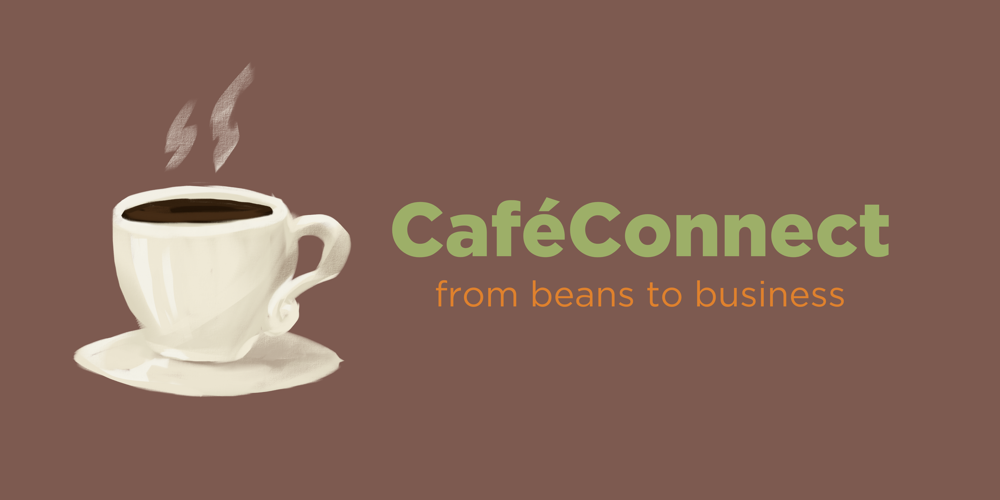

# CaféConnect

**CaféConnect is a desktop application for managing your café's staff, customers, and drink menu.** While it has a GUI, most of the user interactions happen using a CLI (Command Line Interface).

* If you are interested in using CaféConnect, head over to the [_Quick Start_ section of the **User Guide**](UserGuide.html).
* If you are interested in developing CaféConnect, the [**Developer Guide**](DeveloperGuide.html) is a good place to start.

## Key Features

* Manage staff records with roles, shift timings, and performance tracking
* Track customer details, visit history, and reward points
* Maintain a customizable drink menu with categories and pricing
* Record customer purchases and automatically update loyalty data

## Acknowledgements

* This project is based on the AddressBook-Level3 project created by the [SE-EDU initiative](https://se-education.org).
* Libraries used: [JavaFX](https://openjfx.io/), [Jackson](https://github.com/FasterXML/jackson), [JUnit5](https://github.com/junit-team/junit5)
